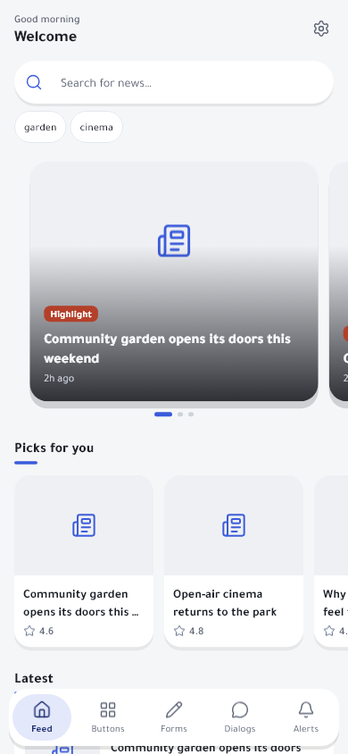
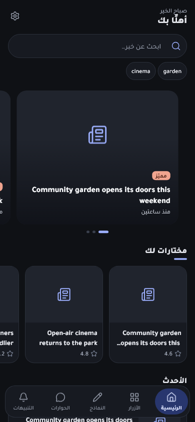
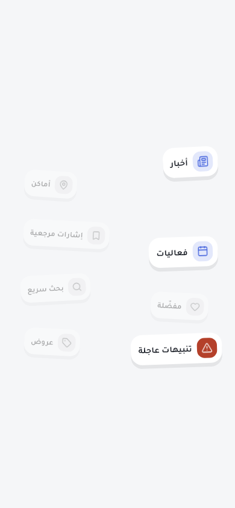
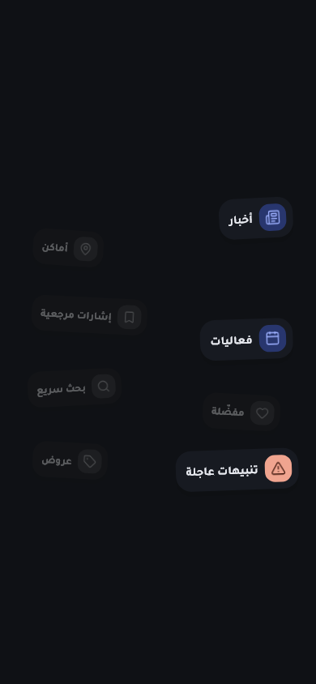
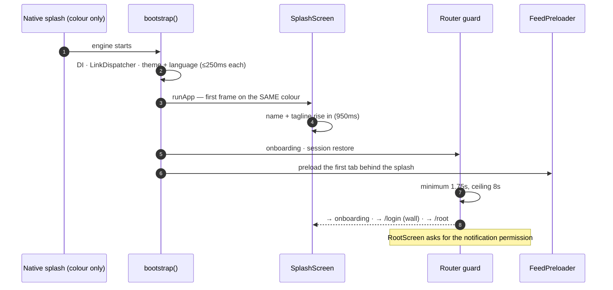
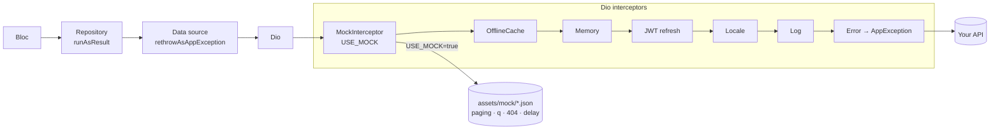
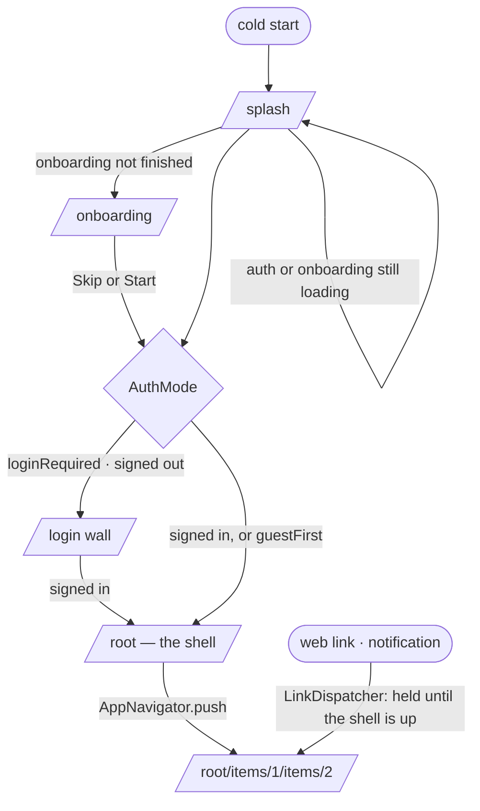
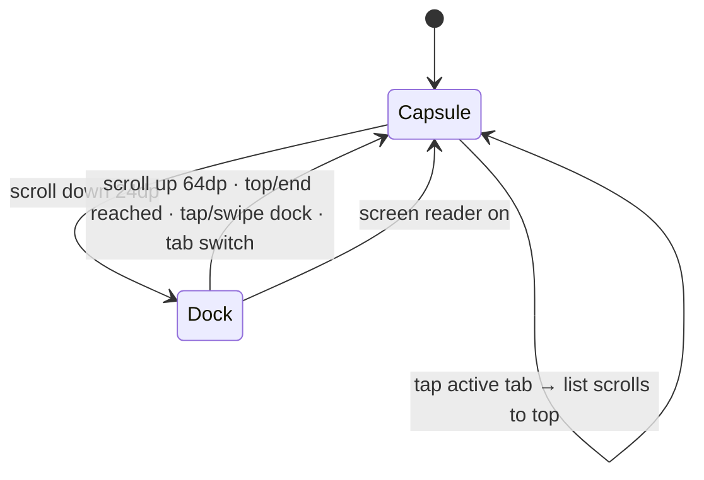

<div align="center">


[](https://github.com/felangel/mason)


**A Mason brick that turns `flutter create` into a production-ready app skeleton** —
BLoC clean architecture, a real design system with skeleton loading and a motion kit,
a floating navigation bar that tucks into a dock, a mock-data layer, nested routing with
deep links, auth modes, Arabic/English, 290+ tests, and release docs down to the Gradle line.

[Quickstart](#-quickstart--zero-to-running-in-9-steps) ·
[What you get](#-what-you-get) ·
[Screens](#-screens) ·
[Architecture](#-architecture) ·
[Guides](#-guides) ·
[Every document, explained](#-every-document-in-the-generated-app) ·
[Release](#-release)

</div>

---

## ✨ What you get


| Area | In the generated app |
| --- | --- |
| **Architecture** | Feature folders `data → domain → presentation`, BLoC + freezed, injectable/get_it, `Result` + `BlocStatus` (one per operation) |
| **Design system** | Tokens (spacing, radii, durations, curves, states), explicit light/dark colour schemes with a semantic extension, bundled Tajawal font, 55 Lucide icons compiled to vector graphics, 20+ `ds/` widgets |
| **Loading** | `SkeletonWidget`: `.success()` and `.loading()` over **one** layout, synced screen-wide sweep, 300ms delay / 500ms minimum, `SkeletonMore` for paging — plus a mandatory height-parity test |
| **Motion** | Scroll reveal (both directions, fling-aware), once-per-run opening choreography, count-up, accent line, glint, Ken Burns, parallax, pop-in, rail nudge, pull-to-refresh, back-to-top, rotating hint — all finite, all reduced-motion aware |
| **Shell** | Floating capsule nav bar that morphs into a dock on scroll, cross-fade tab stack that keeps state, reselect-to-top, staged cross-tab navigation, exit confirmation, notification permission asked from the shell |
| **Startup** | Colour-only native splash → logo-less in-app splash on the same colour; saved theme + language read before the first frame; first tab preloaded behind the splash |
| **Routing** | `AppPage` tree: pages nest under the page that opens them (one stack, paths that read like the walk), Android predictive back, `LinkDispatcher` opens web links and notification taps OVER the shell |
| **Data** | Dio: mock → offline cache → memory → JWT refresh → localization → log → error. `USE_MOCK=true` answers from `assets/mock/` with paging, search, 404s, delay/empty/error/offline switches |
| **Auth** | `AuthMode.loginRequired` (wall) or `guestFirst` (sign-in sheet on protected actions, the action resumes after sign-in), session-expired handling that never loses your screen |
| **l10n** | easy_localization + a generator that refuses missing keys, mismatched placeholders and duplicates, and turns plural groups (Arabic's six forms) into typed methods |
| **Quality** | 290+ tests: bloc, widget, golden (real fonts), height parity, theme contrast, route guard, links, mock routes, l10n discipline, one integration boot test |
| **Release** | `tool/build_release_apk.dart`, `codemagic.yaml`, and complete docs for Android (R8, arm64, signing, 120 Hz, links), iOS, Codemagic and optional Shorebird patches |
| **Showcase** | A reference feature (sectioned feed, detail page, search, settings) and component tabs — delete when you no longer need them |

---

## 📱 Screens

Rendered by the golden tests in the generated app, so they always match the code.

<table>
<tr>
<td align="center" width="25%"><br/><sub><b>Feed</b> · English · light</sub></td>
<td align="center" width="25%"><br/><sub><b>Feed</b> · Arabic RTL · dark</sub></td>
<td align="center" width="25%"><br/><sub><b>Onboarding</b> · light</sub></td>
<td align="center" width="25%"><br/><sub><b>Onboarding</b> · dark</sub></td>
</tr>
</table>

### The floating bar


24dp of scrolling down morphs the capsule into a dock (current tab + a dot per tab);
64dp up, either end of the list, a tap or a swipe on the dock brings it back. Never hides
while a screen reader is on.

### One layout, two constructors


```dart
class FeedCard extends SkeletonWidget {
  const FeedCard.success({super.key, required FeedItemEntity this.item}) : super.success();
  const FeedCard.loading({super.key}) : item = null, super.loading();

  final FeedItemEntity? item;

  @override
  Widget buildBody(BuildContext context) => AppCard(
    child: Row(children: [
      SkeletonBox(width: 84, height: 84, child: AppThumbnail(imageUrl: item?.imageUrl)),
      Expanded(child: SkeletonText(item?.title, maxLines: 2)),
    ]),
  );
}
```

Add a line to the card and the skeleton grows it too — there is only one `Row`.

---

## 🏛 Architecture


### Boot sequence



### A request, with the mock layer on



### Where the router sends you



### The navigation bar's states



---

## 🚀 Quickstart — zero to running in 9 steps

> **You need:** Flutter **3.44+** (Dart 3.12), Android Studio or Xcode, and Mason:
> `dart pub global activate mason_cli`

**1 · Create the Flutter project** — it provides `android/` and `ios/`; the brick provides everything else.

```bash
flutter create --org com.yourcompany --project-name my_app my_app
cd my_app
```

✅ You see the counter app files. They are replaced in step 3.

**2 · Point Mason at the brick**

```bash
mason init
```

In `mason.yaml` (pin a tag or commit):

```yaml
bricks:
  flutter_app_template:
    git:
      url: https://github.com/fat7i-alghareeb/flutter_starter_template.git
      ref: v0.2.0
```

Or use a local checkout: `mason add flutter_app_template --path ../flutter_starter_template`

```bash
mason get
```

**3 · Generate**

```bash
mason make flutter_app_template --on-conflict overwrite
```

| Prompt | Example | Becomes |
| --- | --- | --- |
| `project_name` | `my_app` | the Dart package (must match `--project-name`) |
| `project_title` | `My App` | the app's name, splash, launcher label |
| `package_name` | `com.yourcompany.my_app` | Android `applicationId` / iOS bundle id (must match `--org` + name) |
| `project_description` | … | `pubspec.yaml` description |

✅ `lib/`, `test/`, `assets/`, `docs/`, `tool/`, `.vscode/`, `.ai/` now exist.

**4 · Dependencies and generated code**

```bash
flutter pub get
dart run build_runner build
dart run tool/generate_app_strings.dart
flutter analyze
```

✅ `No issues found!`

**5 · Android: the two lines every build needs**

The plugins need `compileSdk = 37` and core-library desugaring — without them even a
debug build stops with *«requires core library desugaring»*. In `android/app/build.gradle.kts`:

```kotlin
android {
    compileSdk = 37
    compileOptions { isCoreLibraryDesugaringEnabled = true /* … */ }
}
dependencies { coreLibraryDesugaring("com.android.tools:desugar_jdk_libs:2.1.4") }
```

Better: paste the whole file from `docs/ANDROID_RELEASE_SETUP.md` §6 now.

**6 · Run it with mock data**

```bash
flutter run --dart-define=USE_MOCK=true
```

Or in VS Code pick **App (Debug, mock data)**. ✅ Splash → onboarding → sign-in (the
demo identity is filled in: tap **Sign in**) → the feed fills in from `assets/mock/`.

**7 · Run the tests**

```bash
flutter test
```

✅ ~300 tests pass, goldens included (they render with the real font).

**8 · Make it yours** — the app name, colours, font, icon and splash
([Branding](#-branding)), then your first feature:

```bash
dart run tool/generate_feature.dart orders --mock
```

**9 · Before the first release** — follow `docs/ANDROID_RELEASE_SETUP.md` (signing, a
much smaller APK, 120 Hz, links) and `docs/IOS_SETUP.md`.

---

## 🧭 Guides

<details>
<summary><b>▶ Launch configurations (<code>.vscode/launch.json</code>)</b></summary>

| Config | Defines |
| --- | --- |
| App (Debug) | — |
| App (Debug, mock data) | `USE_MOCK=true` |
| App (Debug, mock data, stage tools) | `USE_MOCK=true`, `STAGE_TOOLS=true` |
| Stage Tools (Debug) | `STAGE_TOOLS=true` |
| App (Profile) | — (profile mode) |
| App (Release, mock data) | `USE_MOCK=true` (release mode) |
| App (Release) | — (release mode) |

</details>

<details>
<summary><b>🧪 Mock mode — develop before the API exists</b></summary>

`--dart-define=USE_MOCK=true` makes `MockInterceptor` (the first Dio interceptor) answer
every request from `assets/mock/`, so repositories, parsing, paging and error handling
run exactly as against a server.

| Define | Effect |
| --- | --- |
| `USE_MOCK=true` | Serve fixtures |
| `MOCK_DELAY_MS=600` | Latency (default clears the 300ms skeleton threshold) |
| `MOCK_EMPTY=/showcase/feed` | Empty list for these paths |
| `MOCK_ERROR=/showcase/picks` | Server error for these paths |
| `MOCK_OFFLINE=true` | Everything offline — see the cache and the offline banner |

Map a path to a file in `MockRoutes` (`lib/core/config/mock_config.dart`):

```dart
('/orders/{id}', 'assets/mock/orders/list.json#id={id}'),  // one item of the list, 404 if absent
('/orders',      'assets/mock/orders/list.json'),           // paged, searchable (?page ?limit ?q ?sort)
```

Dates are relative (`"createdAt": "-2h"`) so fixtures never age. List every
`assets/mock/<feature>/` folder in `pubspec.yaml`. More: `assets/mock/README.md`.

</details>

<details>
<summary><b>🛠 Stage tools — device frames, language and theme on the fly</b></summary>

`--dart-define=STAGE_TOOLS=true` adds three draggable buttons (above the nav bar):
DevicePreview frames, a language sheet and a theme sheet. Without the define the code is
compiled out of the build.

</details>

<details>
<summary><b>🧩 Adding a feature</b></summary>

```bash
dart run tool/generate_feature.dart "order item" --mock
```

Creates `lib/features/order_item/` (params, data source, model, mapper, repository
contract + impl, facade, bloc with freezed event/state, screen, body with every state,
and a `SkeletonWidget` card), runs `build_runner`, and with `--mock` writes
`assets/mock/order_item/list.json` and prints the `MockRoutes` and `pubspec.yaml`
lines. Then:

1. Write the spec from `docs/FEATURE_SPEC_TEMPLATE.md`.
2. Register an `AppPage` and open it with `AppNavigator.push`.
3. Add the card to `test/common/widgets/ds/skeleton_parity_test.dart`.
4. Strings in `assets/l10n/*.json` → `dart run tool/generate_app_strings.dart`.

Copy patterns from `lib/features/showcase_feed/` — lazy sections, paging, search, detail
page, save with undo, 404 vs failure, preloading, tests.

</details>

<details>
<summary><b>🎬 Motion kit</b></summary>

| Widget | Does |
| --- | --- |
| `.revealOnScroll()` / `ScrollReveal` | Fade + scale + rise as an item crosses an edge (both directions, fling-aware) |
| `AppIntro` + `AppIntroSlot` | A once-per-run opening: parts enter on staggered intervals of one controller |
| `AppCountUp` | Numbers count up the first time they appear |
| `AppAccentLine` | The accent bar under a section title draws in |
| `AppGlint` | A one-shot shine across a badge |
| `AppKenBurns` / `AppParallax` | Slow zoom on the active slide / drift while the list moves |
| `AppPopIn` / `AppRailNudge` | Tiles pop in / a rail slides once to show it scrolls |
| `AppRefresh` / `AppBackToTop` | Pull to refresh / a button after two screens |
| `AppRotatingHint` | «Search for *news*…» with a rotating word, paused when unseen |

Rules: finite, interruptible, `transform`/`opacity` only, and `MediaQuery.disableAnimations` honoured. Details: `DESIGN_SYSTEM.md` § Motion.

</details>

<details>
<summary><b>🔐 Auth modes</b></summary>

`lib/utils/constants/app_flow_constants.dart`:

```dart
static const AuthMode authMode = AuthMode.loginRequired; // or AuthMode.guestFirst
```

| | `loginRequired` | `guestFirst` |
| --- | --- | --- |
| After onboarding | Sign-in wall | Straight into the app as a guest |
| Protected action | — | Sign-in sheet naming the action; it runs by itself after sign-in |
| Sign out | Back to the wall | Keeps browsing as a guest |
| Session expired | Wall with «your session has ended» | Banner over the app; the user stays where they were |

With no base URL in `ApiConfig`, sign-in uses a demo session so the flow works out of
the box. The tests run the rules of whichever mode you pick.

</details>

<details>
<summary><b>🔗 Deep links</b></summary>

`AppLinks` (`lib/core/router/app_links.dart`) holds your hosts and scheme and which pages
a link may open. `LinkDispatcher` pushes a link OVER the shell — on a cold start it holds
it until the shell is up — so back always lands in the app. Notification taps take the
same road. Native side: `docs/ANDROID_RELEASE_SETUP.md` §8 and `docs/IOS_SETUP.md` §4.

</details>

<details>
<summary><b>🔔 Notifications</b></summary>

Local notifications work out of the box; the permission is asked from the shell, never
behind the splash. FCM is off: set `_fcmEnabled = true` in `bootstrap.dart` after adding
Firebase (Android: `google-services.json`; iOS: `docs/IOS_SETUP.md` §3). Full guide:
`lib/core/notification/notification.md`.

</details>

<details>
<summary><b>🌍 Localization</b></summary>

- Strings live in `assets/l10n/en.json` and `ar.json` and are read through `AppStrings`.
- `dart run tool/generate_app_strings.dart` refuses: a key missing in one language, a
  placeholder count that differs, the same sentence under two keys.
- A count is a plural group — `"feed.readMinutes.one"`, `".two"`, `".few"`, `".other"` —
  and becomes `AppStrings.feedReadMinutes(count, AppFormats.number(context, count))`.
- First launch follows the device language (`AppLocalizationConfig`); the choice is saved.
- Numbers, dates and relative time go through `AppFormats`.

</details>

---

## 🎨 Branding

| What | Where |
| --- | --- |
| Colours | `lib/core/theme/app_colors.dart` — change `primary*`, `backGround*`, `surface*`; contrast is tested |
| Native splash | `flutter_native_splash.yaml` — keep its colours equal to the background colours, then `dart run flutter_native_splash:create --path flutter_native_splash.yaml` |
| In-app splash | `lib/features/splash/…/splash_screen.dart` — the name + tagline; add a logo there if you want one |
| App icon | Put `assets/images/app_icon.png` (1024²) and `app_icon_foreground.png`, then `dart run flutter_launcher_icons -f flutter_launcher_icons.yaml` |
| Font | Replace `assets/fonts/` + the `fonts:` block in `pubspec.yaml` + `AppTypography` |
| Name / tagline | `app.name` / `app.tagline` in `assets/l10n/*.json` |
| Link host, scheme | `AppLinks.hosts`, `AppLinks.scheme` |

The full visual rules: `DESIGN_SYSTEM.md`.

---

## 📦 Release

| Step | Document |
| --- | --- |
| **Measured on a generated app: release APK 74.5 MB → 11.6 MB** by pasting that doc's files as they are. Signing, R8 without blanket keeps, arm64-only APK, compressed native libs, locale filters, 120 Hz, per-app night mode for the Android 12 splash, links, notification icon | `docs/ANDROID_RELEASE_SETUP.md` |
| Podfile permission flags, Info.plist, push, universal links | `docs/IOS_SETUP.md` |
| Local release APK (arm64, obfuscated, symbols saved) | `dart run tool/build_release_apk.dart [--mock] [--clean]` |
| CI: APK, mock APK, AAB, TestFlight | `codemagic.yaml` + `docs/CODEMAGIC.md` |
| Over-the-air Dart patches (optional) | `docs/SHOREBIRD.md` — includes the full `tool/shorebird.dart` |

---

## 📚 Every document in the generated app

Every `.md` the brick generates, what it is for, and when to read it.

<details open>
<summary><b>Project root</b></summary>

| File | What it is about |
| --- | --- |
| [`DESIGN_SYSTEM.md`](__brick__/DESIGN_SYSTEM.md) | The visual rules and why: palette + measured contrast, type scale, spacing, shape, one shadow, icons, every `ds/` component, loading/empty/error states, motion table, the shell, RTL and accessibility, do/don't. Read before building any UI. |

</details>

<details open>
<summary><b><code>docs/</code> — how to work on and ship the app</b></summary>

| File | What it is about |
| --- | --- |
| [`COMMANDS.md`](__brick__/docs/COMMANDS.md) | Every command: setup, the run matrix (mock, stage tools, profile, release), mock switches, strings, feature generator, tests, icons/splash, release builds, and what never to run. |
| [`DECISIONS.md`](__brick__/docs/DECISIONS.md) | The durable decisions and their reasons — skeletons over spinners, correct first frame, first-tab preload, auth-mode switch, one navigation stack, mock at the Dio level, version only from pubspec, optional Shorebird, docs-only native setup. |
| [`PROJECT_MAP.md`](__brick__/docs/PROJECT_MAP.md) | Where everything lives — top level, `core/`, `common/`, `utils/`, `features/` — and which guide to read for which folder. |
| [`FEATURE_SPEC_TEMPLATE.md`](__brick__/docs/FEATURE_SPEC_TEMPLATE.md) | The spec to copy before writing a feature: purpose, main path, interactions, states, edge cases, rules, architecture, API, mock data, strings, a11y, tests. |
| [`PERFORMANCE_AUDIT.md`](__brick__/docs/PERFORMANCE_AUDIT.md) | Startup contract, the fixed breakpoints, frame-rate rules from a raster pass (shadows, ShaderMask, TickerMode, HeroMode, lazy sections) and APK size. |
| [`ANDROID_RELEASE_SETUP.md`](__brick__/docs/ANDROID_RELEASE_SETUP.md) | Every Android file in full, ready to paste: signing, Gradle, R8 rules, manifest, backup rules, notification icon, `MainActivity.kt` (120 Hz + night mode), verification. |
| [`IOS_SETUP.md`](__brick__/docs/IOS_SETUP.md) | Podfile with permission flags, Info.plist additions, push (APNs + FCM), universal links, build and symbols. |
| [`CODEMAGIC.md`](__brick__/docs/CODEMAGIC.md) | Setting up `codemagic.yaml`: repository, Android keystore, App Store Connect key, versioning, artifacts. |
| [`SHOREBIRD.md`](__brick__/docs/SHOREBIRD.md) | Optional over-the-air patches: what is patchable, setup, the complete `tool/shorebird.dart`, the release/patch cycle, the mock app, Codemagic workflows, troubleshooting. |
| [`AGENT_TASK_PROMPT_TEMPLATE.md`](__brick__/docs/AGENT_TASK_PROMPT_TEMPLATE.md) | Copy-paste prompts for an AI coding agent: direct implementation, planning only, new feature, screen from a design, bug fix, small task. |

</details>

<details open>
<summary><b><code>lib/</code> — guides next to the code they describe</b></summary>

| File | What it is about |
| --- | --- |
| [`lib/lib_overview.md`](__brick__/lib/lib_overview.md) | The entry point for the source tree: the top-level folders and the reading order. |
| [`lib/ui_overview.md`](__brick__/lib/ui_overview.md) | How a screen is put together — screen → body → sections → `ds/` widgets — and where the shell fits. |
| [`lib/core/core_architecture_overview.md`](__brick__/lib/core/core_architecture_overview.md) | The cross-cutting foundations: DI, network, errors, config, theme, services. |
| [`lib/core/router/router_guide.md`](__brick__/lib/core/router/router_guide.md) | The guard, the startup flow, the `AppPage` tree, `AppNavigator`, `AppLinks`/`LinkDispatcher`, and how to add a page. |
| [`lib/core/notification/notification.md`](__brick__/lib/core/notification/notification.md) | Local notifications, channels, scheduling, taps, turning FCM on, and the native setup it needs. |
| [`lib/core/services/session/session_service_guide.md`](__brick__/lib/core/services/session/session_service_guide.md) | Tokens, `AuthManager`, `AuthStateNotifier`, guest mode, refresh and session expiry. |
| [`lib/core/services/objectbox/objectbox_service_guide.md`](__brick__/lib/core/services/objectbox/objectbox_service_guide.md) | The local database: entities, the model file, migrations, the lazy service. |
| [`lib/common/common_folder_guide.md`](__brick__/lib/common/common_folder_guide.md) | Reusable widgets: the `ds/` design system, motion preference order, responsive sizing, each common widget. |
| [`lib/common/widgets/form/date_time_field/app_reactive_date_time.md`](__brick__/lib/common/widgets/form/date_time_field/app_reactive_date_time.md) | The reactive date/time field: modes, pickers, validation. |
| [`lib/features/features_overview.md`](__brick__/lib/features/features_overview.md) | The feature structure, layer contracts, `BlocStatus` + `StatusBuilder`, and how presentation consumes state. |
| [`lib/utils/utils_folder_guide.md`](__brick__/lib/utils/utils_folder_guide.md) | Constants, extensions, helpers (`AppFormats`, `ArabicText`) and generated accessors. |

</details>

<details open>
<summary><b>Tests, data and agent rules</b></summary>

| File | What it is about |
| --- | --- |
| [`test/README.md`](__brick__/test/README.md) | The test contract: layout, kinds of test, what every feature must test, harness rules learned the hard way, goldens, bugs these tests caught. |
| [`integration_test/README.md`](__brick__/integration_test/README.md) | Running the on-device boot test, the permission trap, and what the one test walks. |
| [`assets/mock/README.md`](__brick__/assets/mock/README.md) | Fixture conventions: envelope, relative dates, stable ids, routing, paging/search, switches. |
| [`.ai/project-rules.md`](__brick__/.ai/project-rules.md) | The always-loaded rules for AI agents — read first by every tool below. |
| [`.ai/architecture-rules.md`](__brick__/.ai/architecture-rules.md) | Layer boundaries, state, data-layer contracts. |
| [`.ai/flutter-ui-rules.md`](__brick__/.ai/flutter-ui-rules.md) | UI rules: tokens, icons, skeletons, states, motion, assets. |
| [`.ai/localization-rules.md`](__brick__/.ai/localization-rules.md) | `AppStrings` only, keys, plural groups, the generator. |
| [`.ai/code-quality-rules.md`](__brick__/.ai/code-quality-rules.md) | Naming, file size, comments, analyzer hygiene. |
| [`.ai/task-workflow.md`](__brick__/.ai/task-workflow.md) | How an agent plans, implements and verifies a task. |
| [`.ai/final-checklist.md`](__brick__/.ai/final-checklist.md) | The checklist before calling a task done. |
| [`.github/copilot-instructions.md`](__brick__/.github/copilot-instructions.md) · [`.trae/rules/project_rules.md`](__brick__/.trae/rules/project_rules.md) · [`.agents/rules/always_on_architecture.md`](__brick__/.agents/rules/always_on_architecture.md) · [`.agents/skills/global_rules/SKILL.md`](__brick__/.agents/skills/global_rules/SKILL.md) · `.cursorrules` · `.windsurfrules` | Thin pointers so Copilot, Trae, Cursor, Windsurf and other agents all load `.ai/project-rules.md`. |

</details>

---

## ❓ Troubleshooting

| Symptom | Fix |
| --- | --- |
| Import errors mentioning another package name | `dart run build_runner build` (regenerates `injectable.config.dart`) |
| `AppStrings.x` missing after editing JSON | `dart run tool/generate_app_strings.dart` — read its refusal message |
| Mock mode shows nothing | Is the folder listed in `pubspec.yaml`? Is the path in `MockRoutes`? |
| Goldens fail on CI only | Different OS rasterises text differently: `flutter test --exclude-tags golden` there |
| A tab list hides under the bar | Bottom padding `AppBottomNav.listBottomPadding(context)` |
| Sign-in does nothing with a real API | Implement `AuthRemoteDataSource.signIn` for your backend's response shape |

---

## 🗂 This repository

```
flutter_starter_template/
├── brick.yaml            the brick and its four variables
├── __brick__/            everything that is generated into your app
├── docs/readme/          this README's images (never generated into apps)
└── CHANGELOG.md
```

Changes: [`CHANGELOG.md`](CHANGELOG.md). Licence: [`LICENSE`](LICENSE). Icons: [Lucide](https://lucide.dev) (ISC). Font: Tajawal (SIL OFL, `assets/fonts/OFL.txt`).
