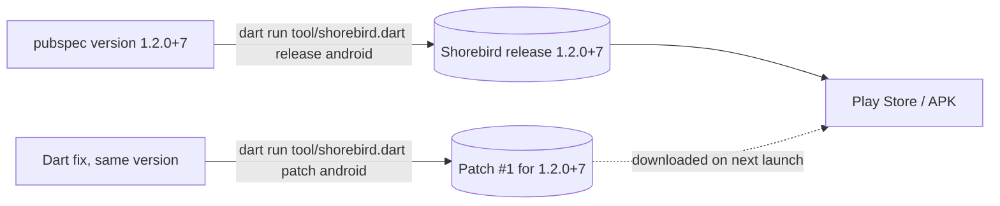

# Shorebird — over-the-air Dart patches (optional)

[Shorebird](https://shorebird.dev) pushes **Dart code** fixes straight to
installed apps, without a store review. The template does not depend on it:
nothing in `lib/` or `pubspec.yaml` changes until you follow this page. Every
file you need is below, complete.



---

## 1. What can and cannot be patched

| Patchable (Dart) | Needs a new store release |
| --- | --- |
| Any code under `lib/` | Assets: JSON, translations (`assets/l10n`), images, fonts, mock fixtures |
| Business logic, UI, bloc, routing | A new or upgraded plugin (`pubspec.yaml` dependencies) |
| Strings written in Dart | Anything in `android/` or `ios/`: Gradle, manifest, Podfile, Info.plist |
| | A Flutter or JDK version change |

Rule of thumb: if `git diff` touches anything outside `lib/`, it is a release.

## 2. One-time setup

```bash
# 1. install (macOS/Linux; Windows: see shorebird.dev/docs/getting-started)
curl --proto '=https' --tlsv1.2 https://raw.githubusercontent.com/shorebirdtech/install/main/install.sh -sSf | bash
shorebird --version

# 2. sign in (opens a browser)
shorebird login

# 3. from the project root: creates the app in the console, writes
#    shorebird.yaml and adds it to pubspec.yaml assets
shorebird init
```

`shorebird.yaml` looks like this — **commit it**:

```yaml
# This file is used to configure the Shorebird updater used by your app.
app_id: 00000000-0000-0000-0000-000000000000
# auto_update: false   # set to take patches only when YOU call the updater
```

**Same JDK everywhere.** Shorebird compares a patch build with its release to
detect native changes, and a different JDK makes R8 emit different Android
code — every patch then fails as a «native change». Pin one:

```bash
flutter config --jdk-dir "<path to JDK 21>"
```

and keep `java: 21` in `codemagic.yaml`.

**Byte-identical assets.** The template ships `.gitattributes` with
`assets/** text=auto eol=lf`. Without it a Windows checkout (autocrlf) bundles
CRLF JSON while CI bundles LF, and a patch built on Windows for a CI release
sees every translation as «changed» and is refused.

**Release signing** must be set up first (`docs/ANDROID_RELEASE_SETUP.md` §2):
a release signed with the debug key can never install over a real one.

## 3. `tool/shorebird.dart` — the only way to release or patch

Typing `shorebird release` by hand gets three things wrong:

1. **Version.** `pubspec.yaml`'s `version:` must be the only source; a
   forgotten bump should fail in seconds, not after a full build.
2. **Flutter version.** A bare `shorebird release` builds with the **latest**
   stable Flutter, not the one the project is tested on. The script always
   passes `--flutter-version=system`.
3. **Build inputs.** A patch compiled with different dart-defines than its
   release silently ships a different app (`USE_MOCK` flipped, stage tools
   compiled in). Release and patch read them from one list; overriding them
   is refused.

It also cuts the sideloadable APK **from the uploaded AAB** and proves its
`libapp.so` byte-identical: with `--artifact=apk` Shorebird compiles twice,
and under `--obfuscate` the two compiles differ — every installed copy of such
an APK refuses all patches.

Create `tool/shorebird.dart` with exactly this content:

```dart
// Shorebird release / patch with this project's fixed build flags.
//
// Run from the project root:
//   dart run tool/shorebird.dart release android [--mock] [--dry-run]
//   dart run tool/shorebird.dart patch   android [--mock] [--dry-run]
//   dart run tool/shorebird.dart release ios     [--export-options-plist=<path>] [--dry-run]
//   dart run tool/shorebird.dart patch   ios     [--export-options-plist=<path>] [--dry-run]
//
// Any other argument is passed through to shorebird unchanged. Use this instead
// of typing `shorebird release` / `shorebird patch` by hand, which gets these
// wrong:
//
//   Version          pubspec.yaml `version:` is the only source. A release is
//                    that exact version+build; a patch targets that exact
//                    release. Bump the +N in pubspec.yaml before each release;
//                    patches never bump it. To patch an older release, check
//                    out its commit (tag it when it ships). Both are checked
//                    against Shorebird up front, so a forgotten bump fails in
//                    seconds instead of after a full build.
//   Flutter version  A bare `shorebird release` builds with the LATEST stable
//                    Flutter, not the one this project is developed and tested
//                    on. This always passes --flutter-version=system: the
//                    `flutter` on PATH — locally your own install, on Codemagic
//                    the `flutter:` version in codemagic.yaml. Patches take no
//                    version: Shorebird builds each one with its release's.
//   Build inputs     A patch must be compiled from the same entrypoint and
//                    dart-defines as its release, or it silently ships a
//                    different app (USE_MOCK flipped, stage tools compiled in).
//                    Release and patch both read them from the lists below, and
//                    overriding them is refused.
//
// --mock (Android only) builds the mock-data APK: USE_MOCK=true, its own
// package id ({{package_name}}.mock) and launcher name, and its own
// Shorebird app, "{{project_title}} Mock". A separate app is what keeps mock releases and
// patches away from real installs — same version numbers, different app. For
// the run, shorebird.yaml's app_id is swapped to the mock one (the CLI and the
// bundled updater both read that file), then restored.
//
// An Android release also leaves the sideloadable APK at
// build/app/outputs/flutter-apk/app-release.apk, cut from the uploaded AAB
// and verified byte-identical to it (see _androidReleaseArgs for why).
//
// Release flags match tool/build_release_apk.dart: arm64-only APK, obfuscated,
// Dart symbols in build/symbols. A patch reuses its release's obfuscation on
// its own, so it takes no --obfuscate.

import 'dart:async';
import 'dart:convert';
import 'dart:io';

/// The "{{project_title}} Mock" app in the Shorebird console
/// (`shorebird apps create --app-name "{{project_title}} Mock"` prints it).
/// The real app's id is the one committed in shorebird.yaml.
const _mockAppId = 'PASTE-THE-MOCK-APP-ID';

/// Passed to both release and patch. Changing any of these between a release
/// and its patches changes what the patch does, so they live in one place.
const _sharedArgs = <String>[
  '-t',
  'lib/main.dart',
  '--split-debug-info=build/symbols',
];

const _realArgs = <String>['--dart-define=USE_MOCK=false'];

const _mockArgs = <String>['--dart-define=USE_MOCK=true'];

/// Forwarded to `flutter build` (after `--`); read by
/// android/app/build.gradle.kts so the mock APK installs beside the real one.
const _mockGradleArgs = <String>[
  '--android-project-arg=appIdSuffix=.mock',
  '--android-project-arg=appLabel={{project_title}} Mock',
];

const _releaseArgs = <String>['--flutter-version=system', '--obfuscate'];

/// arm64 only, like tool/build_release_apk.dart. No `--artifact=apk`: with it
/// shorebird compiles the app twice — once for the AAB it uploads as the
/// release, once more for the APK — and under --obfuscate the two compiles
/// differ (measured on a real release: same-size libapp.so, 1.28 MB of
/// different bytes).
/// Every installed copy then failed "binary is different from the version
/// submitted to Shorebird" and refused all patches. The APK is instead cut
/// from the uploaded AAB itself; see _apkFromReleaseBundle.
const _androidReleaseArgs = <String>['--target-platform=android-arm64'];

const _bundlePath = 'build/app/outputs/bundle/release/app-release.aab';

/// Where `flutter build apk` puts it, so codemagic.yaml and people find the
/// APK in the usual place.
const _apkPath = 'build/app/outputs/flutter-apk/app-release.apk';

const _libappInBundle = 'base/lib/arm64-v8a/libapp.so';
const _libappInApk = 'lib/arm64-v8a/libapp.so';

/// Flags this script owns. Passing one would let a release and its patches
/// drift apart, or a version differ from pubspec.yaml, so it is rejected
/// rather than silently overridden.
const _reservedFlags = <String>[
  '-t',
  '--target',
  '--flavor',
  '--dart-define',
  '--dart-define-from-file',
  '--flutter-version',
  '--obfuscate',
  '--split-debug-info',
  '--artifact',
  '--target-platform',
  '--build-name',
  '--build-number',
  '--release-version',
  '--app-id',
];

const _usage =
    'Usage: dart run tool/shorebird.dart <release|patch> <android|ios> [--mock] [shorebird args]';

Future<void> main(List<String> args) async {
  if (args.length < 2 ||
      !const {'release', 'patch'}.contains(args[0]) ||
      !const {'android', 'ios'}.contains(args[1])) {
    _fail(_usage);
  }
  final command = args[0];
  final platform = args[1];
  final mock = args.contains('--mock');
  final dryRun = args.contains('--dry-run') || args.contains('-n');
  final passThrough = args.sublist(2).where((a) => a != '--mock').toList();

  final reserved = passThrough.where(_isReserved).toList();
  if (reserved.isNotEmpty || passThrough.contains('--')) {
    _fail(
      'Not allowed: ${[...reserved, if (passThrough.contains('--')) '--'].join(' ')}\n'
      'This script sets that itself so every build follows pubspec.yaml and a '
      'patch is built exactly like its release. Change tool/shorebird.dart '
      'instead.',
    );
  }

  final shorebirdYaml = File('shorebird.yaml');
  if (!shorebirdYaml.existsSync() || !File('pubspec.yaml').existsSync()) {
    _fail('Run this from the project root (no shorebird.yaml here).');
  }

  if (mock && _mockAppId.startsWith('PASTE')) {
    _fail(
      'No mock Shorebird app yet: create it (docs/SHOREBIRD.md § 6) and paste '
      'its id into _mockAppId in tool/shorebird.dart.',
    );
  }

  if (mock && platform != 'android') {
    _fail('--mock is Android only: iOS has no mock variant.');
  }

  if (platform == 'ios' && !Platform.isMacOS) {
    _fail(
      'iOS releases and patches need macOS with Xcode.\n'
      'Run the ios-release / ios-patch workflows on Codemagic instead.',
    );
  }

  if (command == 'release' &&
      platform == 'android' &&
      !File('android/key.properties').existsSync()) {
    _fail(
      'android/key.properties is missing, so this release would be signed '
      'with the DEBUG key and could never install over a release-signed app.',
    );
  }

  final version = _pubspecVersion();
  // Always read: it also catches a mock app_id left behind by a killed run.
  final committedAppId = _committedAppId(shorebirdYaml);
  final appId = mock ? _mockAppId : committedAppId;
  final appName = mock ? '{{project_title}} Mock' : '{{project_title}}';
  _log('$appName $version ($platform)');

  final status = await _releaseStatus(appId, version, platform);
  if (command == 'release' && status == 'active' && !dryRun) {
    _fail(
      '$appName $version is already released for $platform.\n'
      'Bump the build number in pubspec.yaml (version: ${_bumped(version)}) '
      'for a new release, or run `patch` to update this one.',
    );
  }
  if (command == 'patch' && status != null && status != 'active') {
    _fail(
      'No released $appName $version for $platform to patch '
      '(${status == 'missing' ? 'never released' : 'status: $status'}).\n'
      'pubspec.yaml must hold the version of the release being patched — if it '
      'was bumped since, check out the commit that release was built from.',
    );
  }

  final shorebirdArgs = <String>[
    command,
    platform,
    ..._sharedArgs,
    ...mock ? _mockArgs : _realArgs,
    if (command == 'release') ..._releaseArgs,
    if (command == 'release' && platform == 'android') ..._androidReleaseArgs,
    if (command == 'patch') '--release-version=$version',
    ...passThrough,
    if (mock) ...['--', ..._mockGradleArgs],
  ];

  final exitCode = await _withAppId(
    shorebirdYaml,
    appId,
    () => _run(shorebirdArgs),
  );
  if (exitCode == 0 && command == 'release' && platform == 'android') {
    await _apkFromReleaseBundle();
  }
  exit(exitCode);
}

/// Builds the sideloadable APK out of the exact AAB shorebird just uploaded,
/// then proves the Dart binary inside is byte-identical to the release's. An
/// APK that fails this can never take a patch, so it is never handed out.
Future<void> _apkFromReleaseBundle() async {
  final bundle = File(_bundlePath);
  if (!bundle.existsSync()) _fail('Release built, but no $_bundlePath.');

  final work = Directory('build/shorebird_apk');
  if (work.existsSync()) work.deleteSync(recursive: true);
  work.createSync(recursive: true);

  final keys = _keyProperties();
  final password = File('${work.path}/ks.pass')
    ..writeAsStringSync(keys['storePassword']!);
  final keyPassword = File('${work.path}/key.pass')
    ..writeAsStringSync(keys['keyPassword']!);
  final apks = '${work.path}/app.apks';
  try {
    await _runChecked(_java(), [
      '-jar',
      _bundletool(),
      'build-apks',
      '--bundle=$_bundlePath',
      '--output=$apks',
      '--mode=universal',
      '--overwrite',
      '--ks=${File('android/${keys['storeFile']}').absolute.path}',
      '--ks-pass=file:${password.absolute.path}',
      '--ks-key-alias=${keys['keyAlias']}',
      '--key-pass=file:${keyPassword.absolute.path}',
    ], 'bundletool build-apks');
  } finally {
    // Passwords were only ever in files so they never show in a process list.
    password.deleteSync();
    keyPassword.deleteSync();
  }

  await _unzip(apks, 'universal.apk', work.path);
  File(_apkPath).parent.createSync(recursive: true);
  File('${work.path}/universal.apk').copySync(_apkPath);
  // bundletool writes a fixed 1981 timestamp (reproducible output), which
  // made the APK look ancient in Explorer. The contents are unaffected.
  File(_apkPath).setLastModifiedSync(DateTime.now());

  await _unzip(_bundlePath, _libappInBundle, '${work.path}/aab');
  await _unzip(_apkPath, _libappInApk, '${work.path}/apk');
  final fromBundle = File(
    '${work.path}/aab/$_libappInBundle',
  ).readAsBytesSync();
  final fromApk = File('${work.path}/apk/$_libappInApk').readAsBytesSync();
  if (!_sameBytes(fromBundle, fromApk)) {
    File(_apkPath).deleteSync();
    _fail(
      'The APK\'s libapp.so differs from the release\'s — it could never take '
      'a patch. Deleted it; do not distribute this build.',
    );
  }
  final megabytes = (File(_apkPath).lengthSync() / (1024 * 1024))
      .toStringAsFixed(1);
  _log('APK  $_apkPath  ($megabytes MB)');
  _log('     Built from the release AAB; libapp.so verified identical.');
}

/// android/key.properties as a map (storePassword, keyPassword, keyAlias,
/// storeFile — storeFile relative to android/).
Map<String, String> _keyProperties() {
  final keys = <String, String>{};
  for (final line in File('android/key.properties').readAsLinesSync()) {
    final equals = line.indexOf('=');
    if (equals > 0 && !line.trimLeft().startsWith('#')) {
      keys[line.substring(0, equals).trim()] = line
          .substring(equals + 1)
          .trim();
    }
  }
  const required = ['storePassword', 'keyPassword', 'keyAlias', 'storeFile'];
  final missing = required.where((k) => !keys.containsKey(k)).toList();
  if (missing.isNotEmpty) {
    _fail('android/key.properties has no ${missing.join(', ')}.');
  }
  return keys;
}

/// The bundletool shorebird downloads for itself during a release.
String _bundletool() {
  final home =
      Platform.environment[Platform.isWindows ? 'USERPROFILE' : 'HOME'] ?? '';
  final jar = File(
    '$home/.shorebird/bin/cache/artifacts/bundletool/bundletool.jar',
  );
  if (!jar.existsSync()) _fail('bundletool not found at ${jar.path}.');
  return jar.path;
}

/// The JDK Gradle builds with: Flutter's configured jdk-dir first (what
/// `flutter config --jdk-dir` set locally), then JAVA_HOME (Codemagic's
/// `java:`), then whatever `java` is on PATH.
String _java() {
  final exe = Platform.isWindows ? 'java.exe' : 'java';
  final config =
      Process.runSync('flutter', ['config', '--list'], runInShell: true).stdout
          as String;
  final jdkDir = RegExp(
    r'jdk-dir:\s*(.+)',
  ).firstMatch(config)?.group(1)?.trim();
  for (final home in [jdkDir, Platform.environment['JAVA_HOME']]) {
    if (home == null || home.isEmpty || home == '(Not set)') continue;
    final java = File('$home/bin/$exe');
    if (java.existsSync()) return java.path;
  }
  return exe;
}

/// Extracts [entry] from the zip at [zip] into [into]. `tar` reads zip
/// archives on Windows 10+, macOS and Linux alike.
Future<void> _unzip(String zip, String entry, String into) async {
  Directory(into).createSync(recursive: true);
  await _runChecked('tar', ['-xf', zip, '-C', into, entry], 'tar');
}

Future<void> _runChecked(
  String executable,
  List<String> args,
  String label,
) async {
  final result = await Process.run(executable, args);
  if (result.exitCode != 0) {
    _fail(
      '$label failed (${result.exitCode}):\n${result.stderr}${result.stdout}',
    );
  }
}

bool _sameBytes(List<int> a, List<int> b) {
  if (a.length != b.length) return false;
  for (var i = 0; i < a.length; i++) {
    if (a[i] != b[i]) return false;
  }
  return true;
}

bool _isReserved(String arg) =>
    _reservedFlags.any((flag) => arg == flag || arg.startsWith('$flag='));

/// `version:` from pubspec.yaml, which must carry a build number: Shorebird
/// identifies a release by version+build.
String _pubspecVersion() {
  final match = RegExp(
    r'^version:\s*(\S+)\s*$',
    multiLine: true,
  ).firstMatch(File('pubspec.yaml').readAsStringSync());
  final version = match?.group(1);
  if (version == null || !RegExp(r'^\d+\.\d+\.\d+\+\d+$').hasMatch(version)) {
    _fail(
      'pubspec.yaml needs `version: x.y.z+N` (found: ${version ?? 'nothing'}).',
    );
  }
  return version;
}

String _bumped(String version) {
  final plus = version.indexOf('+');
  final build = int.parse(version.substring(plus + 1));
  return '${version.substring(0, plus)}+${build + 1}';
}

String _committedAppId(File shorebirdYaml) {
  final match = RegExp(
    r'^app_id:\s*(\S+)\s*$',
    multiLine: true,
  ).firstMatch(shorebirdYaml.readAsStringSync());
  if (match == null) _fail('No app_id in shorebird.yaml.');
  final appId = match.group(1)!;
  if (appId == _mockAppId) {
    _fail(
      'shorebird.yaml holds the MOCK app_id — a previous --mock run was '
      'killed before it could restore the file. Restore it with:\n'
      '  git checkout -- shorebird.yaml',
    );
  }
  return appId;
}

/// Status of [version] on [platform]: 'active', 'draft' (an upload that never
/// finished; shorebird resumes it), 'missing', or null when Shorebird could
/// not be asked — then the check is skipped and shorebird's own error stands.
Future<String?> _releaseStatus(
  String appId,
  String version,
  String platform,
) async {
  final (executable, arguments) = _shorebird([
    'releases',
    'list',
    '--app-id=$appId',
    '--json',
  ]);
  final result = await Process.run(executable, arguments);
  if (result.exitCode != 0) {
    _log(
      'WARNING: could not list Shorebird releases; skipping the version check.',
    );
    return null;
  }
  try {
    final line = (result.stdout as String)
        .split('\n')
        .lastWhere((l) => l.trimLeft().startsWith('{'));
    final json = jsonDecode(line) as Map<String, dynamic>;
    final releases =
        (json['data'] as Map<String, dynamic>)['releases'] as List<dynamic>;
    for (final release in releases.cast<Map<String, dynamic>>()) {
      if (release['version'] != version) continue;
      final statuses =
          (release['platform_statuses'] ?? release['platformStatuses'])
              as Map<String, dynamic>?;
      return statuses?[platform] as String? ?? 'missing';
    }
    return 'missing';
  } on Object {
    _log(
      'WARNING: unexpected `shorebird releases list` output; skipping the '
      'version check.',
    );
    return null;
  }
}

/// Runs [body] with shorebird.yaml pointing at [appId], restoring the file
/// afterwards — also on Ctrl+C, so a mock app_id is never left behind to be
/// committed or shipped in a real build.
Future<int> _withAppId(
  File shorebirdYaml,
  String appId,
  Future<int> Function() body,
) async {
  final original = shorebirdYaml.readAsStringSync();
  final swapped = original.replaceFirst(
    RegExp(r'^app_id:\s*\S+', multiLine: true),
    'app_id: $appId',
  );
  if (swapped == original) return body();

  void restore() => shorebirdYaml.writeAsStringSync(original);
  shorebirdYaml.writeAsStringSync(swapped);
  final interrupt = ProcessSignal.sigint.watch().listen((_) {
    restore();
    exit(130);
  });
  try {
    return await body();
  } finally {
    await interrupt.cancel();
    restore();
  }
}

Future<int> _run(List<String> shorebirdArgs) async {
  _log('shorebird ${shorebirdArgs.join(' ')}');
  final (executable, arguments) = _shorebird(shorebirdArgs);
  final process = await Process.start(
    executable,
    arguments,
    mode: ProcessStartMode.inheritStdio,
  );
  return process.exitCode;
}

/// How to start shorebird with [args] passed through intact.
///
/// Never through a shell on Windows: shorebird.bat forwards only `%1`–`%9`
/// and cmd splits arguments on `=`, so a release silently lost
/// `--dart-define=USE_MOCK=true` and both `--android-project-arg`s — a "mock"
/// build that talks to the real network. shorebird.ps1, the script the .bat
/// wraps, is called directly instead, every argument single-quoted (literal
/// in PowerShell: `=` and spaces survive). The explicit `exit $LASTEXITCODE`
/// matters too: the script itself always exits 0, which made a failed build
/// look like a success.
(String, List<String>) _shorebird(List<String> args) {
  if (!Platform.isWindows) return ('shorebird', args);
  final script =
      '${Platform.environment['USERPROFILE']}\\.shorebird\\bin\\shorebird.ps1';
  if (!File(script).existsSync()) {
    _fail('Shorebird is not installed: no $script');
  }
  String quote(String value) => "'${value.replaceAll("'", "''")}'";
  final powershell = _onPath('pwsh.exe') ? 'pwsh.exe' : 'powershell.exe';
  return (
    powershell,
    [
      '-NoProfile',
      '-ExecutionPolicy',
      'Bypass',
      '-Command',
      '& ${[script, ...args].map(quote).join(' ')}; exit \$LASTEXITCODE',
    ],
  );
}

bool _onPath(String executable) =>
    Process.runSync('where', ['/Q', executable]).exitCode == 0;

void _log(String message) => stdout.writeln(message);

Never _fail(String message) {
  stderr.writeln(message);
  exit(1);
}
```

Usage:

```bash
dart run tool/shorebird.dart release android            # real app
dart run tool/shorebird.dart release android --mock     # mock-data app
dart run tool/shorebird.dart patch   android            # patch the release pubspec.yaml names
dart run tool/shorebird.dart release ios --export-options-plist=ios/ExportOptions.plist
dart run tool/shorebird.dart release android --dry-run  # checks only, uploads nothing
```

## 4. The release / patch cycle

1. Bump `version: 1.2.0+7` → `1.2.0+8` in `pubspec.yaml`, commit, **tag** it
   (`git tag v1.2.0+8`).
2. `dart run tool/shorebird.dart release android` → upload
   `build/app/outputs/bundle/release/app-release.aab` to Play, or hand out
   `build/app/outputs/flutter-apk/app-release.apk`.
3. A Dart bug is found. Fix it **on that release's code**, keep the version.
4. `dart run tool/shorebird.dart patch android`. Installed apps download the
   patch on their next launch and run it on the one after.
5. To patch an older release after `pubspec.yaml` moved on: check out its tag,
   cherry-pick the fix, patch.

```bash
shorebird releases list          # what is out there
shorebird patches list --release-version 1.2.0+8
```

## 5. Reading a crash from an obfuscated release

Releases are `--obfuscate` with symbols in `build/symbols/` — **archive that
folder with every release** (Codemagic does it as an artifact).

```bash
flutter symbolize -i stack_trace.txt -d build/symbols/app.android-arm64.symbols
```

## 6. The mock app — a second Shorebird app

The mock APK (`USE_MOCK=true`, own package id `{{package_name}}.mock`, own
launcher name) is a **separate Shorebird app**, so its releases and patches can
never reach real installs — same version numbers, different app.

```bash
shorebird apps create --app-name "{{project_title}} Mock"   # prints its app id
```

Paste the id into `_mockAppId` in `tool/shorebird.dart`. During a `--mock` run
the script swaps `shorebird.yaml`'s `app_id` and restores it afterwards (also
on Ctrl+C). If a run was killed hard, it refuses to start until you
`git checkout -- shorebird.yaml`.

The Gradle side of `appIdSuffix` / `appLabel` is in
`docs/ANDROID_RELEASE_SETUP.md` §6.

## 7. Codemagic workflows with Shorebird

In Codemagic: Team settings → Global variables → group **`shorebird`** with a
secure `SHOREBIRD_TOKEN` (`shorebird login:ci` prints one). Then replace the
`build_apk` step and the workflows in `codemagic.yaml` with:

```yaml
    - &shorebird_install
      name: Install Shorebird
      script: |
        set -e
        if [ -z "$SHOREBIRD_TOKEN" ]; then
          echo "SHOREBIRD_TOKEN is empty: add the 'shorebird' group to this workflow." >&2
          exit 1
        fi
        curl --proto '=https' --tlsv1.2 https://raw.githubusercontent.com/shorebirdtech/install/main/install.sh -sSf | bash
        echo PATH="$HOME/.shorebird/bin:$PATH" >> $CM_ENV

    - &shorebird_release_android
      name: Shorebird release (Android)
      script: |
        set -e
        if [ "$APK_VARIANT" = "mock" ]; then
          dart run tool/shorebird.dart release android --mock
        else
          dart run tool/shorebird.dart release android
        fi

    - &shorebird_patch_android
      name: Shorebird patch (Android)
      script: |
        set -e
        if [ "$APK_VARIANT" = "mock" ]; then
          dart run tool/shorebird.dart patch android --mock
        else
          dart run tool/shorebird.dart patch android
        fi
```

Add `groups: [shorebird]` to `android_environment` and `ios_environment`, and
use them in workflows like:

```yaml
  android-release:
    name: Android Release (Shorebird)
    instance_type: mac_mini_m2
    environment:
      <<: *android_environment
      vars:
        APK_VARIANT: release
    scripts:
      - *set_up_signing
      - *get_dependencies
      - *shorebird_install
      - *shorebird_release_android
      - *collect_apk
    artifacts: *artifacts

  android-patch:
    name: Android Patch (Shorebird)
    instance_type: mac_mini_m2
    environment:
      <<: *android_environment
      vars:
        APK_VARIANT: release
    scripts:
      - *set_up_signing
      - *get_dependencies
      - *shorebird_install
      - *shorebird_patch_android
    artifacts:
      - build/symbols/*.symbols

  ios-release:
    name: iOS Release (Shorebird → TestFlight)
    instance_type: mac_mini_m2
    integrations:
      app_store_connect: {{project_name}}_app_store_connect
    environment: *ios_environment
    scripts:
      - *get_dependencies
      - *shorebird_install
      - name: Set up iOS code signing
        script: xcode-project use-profiles
      - name: Shorebird release (iOS)
        script: |
          dart run tool/shorebird.dart release ios \
            --export-options-plist=/Users/builder/export_options.plist
    artifacts:
      - build/ios/ipa/*.ipa
      - build/symbols/*.symbols
    publishing:
      app_store_connect:
        auth: integration
        submit_to_testflight: true
```

(`ios-patch` is `ios-release` with `patch` instead of `release` and no
publishing.) Patches are signed like their release, so the signing steps stay.

## 8. Troubleshooting

| Symptom | Cause | Fix |
| --- | --- | --- |
| «binary is different from the version submitted to Shorebird» | APK compiled separately from the release AAB | Only hand out the APK `tool/shorebird.dart` cut and verified |
| Patch refused as a «native change» | Different JDK than the release, or a plugin/Gradle change | Same `flutter config --jdk-dir` locally and `java:` on CI; a real native change needs a release |
| Every asset «changed» | CRLF vs LF checkout | `.gitattributes` (`assets/** eol=lf`), then `git add --renormalize .` |
| «already released» | Build number not bumped | Bump `+N` in `pubspec.yaml` |
| «No released … to patch» | `pubspec.yaml` moved past the release | Check out the release's tag |
| On Windows a mock build hit the real network | `shorebird.bat` drops args with `=` | The script calls `shorebird.ps1` directly — always use it |
| `shorebird.yaml` holds the mock id | A `--mock` run was killed | `git checkout -- shorebird.yaml` |
